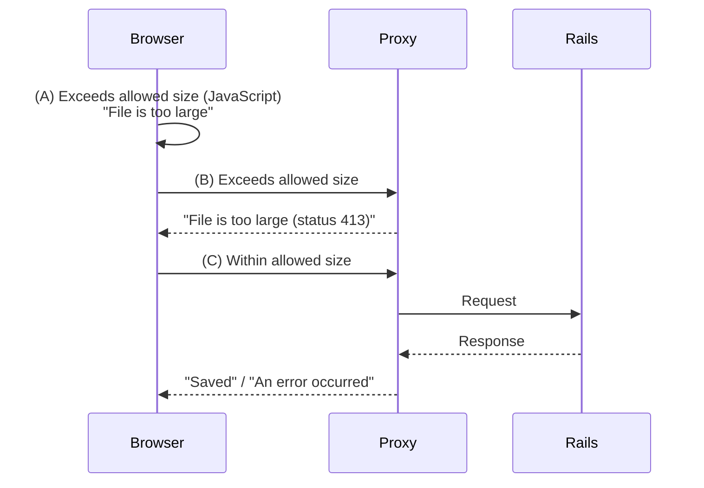

# A unified way to display flash messages (a Rails/Turbo prototype)

I built a demo application that unifies how flash messages are displayed for regular HTML rendering, for Turbo Frames and Turbo Streams, and for client-side initiated messages that don’t come from the server. This article walks through the approach.

GitHub repository: [unified-flash-messages](https://github.com/hiroaki/unified-flash-messages)

## Motivation

I faced two problems at the same time.

### I want to show flash messages from the client side

My initial motivation was to show a message to the user—just like a flash—when a proxy in front of a Rails app terminates the user’s request.

> 

Here’s the concrete story: when a user submits a file that’s too large, even if you validate on the server in case the client-side check (A) is bypassed, Rails shouldn’t accept excessively large payloads in the first place. One mitigation is to have a proxy cut off requests that exceed a size limit (B).

In that situation, I want to show “The file is too large” both when the client-side check triggers and when the proxy responds. But the implementation differs from server-side flash rendering, and I wanted to unify them. In other words, even client-only pathways should display messages using the same UI as server-originated flashes.

And of course, in normal server responses, it’s desirable to keep using flash as-is. (C)



*Figure: In each of the cases (A), (B), and (C), we want to present the “message” using the same UI*


### Display flash messages with Turbo Frames

There was a second issue. When using Turbo Frames for partial page updates, I still wanted to show flash messages.

In my application, I used Turbo Frames to update parts of a page. But a Turbo Frame can only update its own single region, so if the flash area lives outside the frame, you can’t reach it from a frame response.

You could switch to Turbo Streams to update multiple regions, but changing a GET request to POST (or another method) just to achieve that felt wrong, so I looked for an alternative.

```erb
<!-- Flash placed outside the frame cannot be updated from a Turbo Frame response... -->
<ul>
  <% flash.each do |type, message| %>
    <li data-type="<%= type %>"><%= message %></li>
  <% end %>
</ul>

<%= turbo_frame_tag "memos" do %>
  ...
  ...
```

## Implementation overview

I solved these problems as follows:
- Embed server-side flash messages into a hidden DOM element (hereafter the “storage”).
- For client-side messages, do the same—first write them into storage.
- When a page change occurs, read messages from storage, format them with templates, and insert them into the visible container.

The key point is doing the rendering on the client side. Because we have to handle situations where a request never reaches the Rails server, the process of shaping a message like a flash and inserting it at the designated place in the page necessarily becomes a client-side (JavaScript) responsibility.

In fact, that constraint naturally determines the server-side behavior as well. Instead of rendering templates as flashes, we embed the data into the page.

All that’s left is to decide how to embed the relevant messages and to render them at the appropriate times.

In the demo I built, I made the following conventions.


## Embedding flash messages

### Server-side

Server-generated flash messages are embedded in a hidden element. The client will collect from this structure when it performs rendering.

```html
<div data-flash-storage style="display: none;">
  <ul>
    <li data-type="alert">Message 1 content</li>
    <li data-type="notice">Message 2 content</li>
  </ul>
</div>
```

Since this is boilerplate, it’s good to prepare a helper or partial template with the following content:

```erb
<div data-flash-storage style="display: none;">
  <ul>
    <% flash.each do |type, message| %>
      <li data-type="<%= type %>"><%= message %></li>
    <% end %>
  </ul>
</div>
```

This element won’t be rendered or shown where it sits, so it can go anywhere in the document. That means it can live inside a Turbo Frame; in other words, when returning a Turbo Frame response, include this hidden storage structure with the flash messages you want to display.

If you also support Turbo Streams, you’ll need a dedicated global storage area with an id so streams can target it:

```html
<div id="flash-storage" style="display: none;"></div>
```

Then have one of your streams add the “embedded structure”:

```erb
<%= turbo_stream.update "flash-storage", partial: "shared/flash_storage" %>
```

> [!WARNING]
> For example, if the server broadcasts via Turbo Stream, the message is delivered to all clients subscribed to the target stream (i.e., all users affected by the broadcast). You must implement it so the same flash does not appear for unintended users. The “embed → client render” approach described in this article is not affected for normal synchronous responses, but if you also use broadcast-style delivery, pay attention to the scope of the audience.

### Client-side

From the client side, output the same structure (repeated):

```html
<div data-flash-storage style="display: none;">
  <ul>
    <li data-type="alert">Message 1 content</li>
    <li data-type="notice">Message 2 content</li>
  </ul>
</div>
```

Since this is also boilerplate, prepare a function for it:

```javascript
function appendMessageToStorage(message, type = 'alert') {
    const storage = document.createElement('div');
    ...
    ...
```

## Render embedded messages

### Templates

The elements that actually appear—i.e., the render templates—are prepared as `<template>` tags. Create them per type, e.g., notice and alert. The element with the CSS class `flash-message-text` will receive the message:

```html
<template id="flash-message-template-notice">
  <div>
    <span class="flash-message-text"></span>
  </div>
</template>
<template id="flash-message-template-alert">
  <div>
    <span class="flash-message-text"></span>
  </div>
</template>
```

Place a marker at the position where you want the flashes to appear; rendered flashes will be inserted there:

```html
<div data-flash-message-container></div>
```

### Rendering

With these rules in place, write a JavaScript function that formats and displays the embedded message data. For example:

```javascript
function renderFlashMessages() {
  const storages = document.querySelectorAll('[data-flash-storage]');
  const containers = document.querySelectorAll('[data-flash-message-container]');

  // Collect embedded messages
  let messages = [];
  storages.forEach(storage => {
    storage.querySelectorAll('ul li').forEach(li => {
      messages.push({ type: li.dataset.type || 'notice', message: li.textContent.trim() });
    });
    // Remove once extracted to avoid reusing them
    storage.remove();
  });

  containers.forEach(container => {
    messages.forEach(({ type, message }) => {
      // createFlashMessageNode clones the <template> and returns an element with type and message filled in
      if (message) container.appendChild(createFlashMessageNode(type, message));
    });
  });
}
```

All that remains is to invoke it at the right times.

From the client side, just call it directly.

To show messages on server responses, some kind of event will fire on the page, so register listeners for those events and call the render function in their handlers. That way the flash will be drawn automatically as responses arrive.

- turbo:load
- turbo:frame-load
- turbo:render
- turbo:submit-end
- turbo:after-stream-render
- ...

Typically, you’ll primarily watch turbo:frame-load and turbo:after-stream-render, and use turbo:load or turbo:submit-end as needed.

For example, when a form is submitted, even if the request never reaches Rails due to a proxy error or network failure, you can assemble an error message from the response and display it as a flash purely on the client side:

```javascript
document.addEventListener('turbo:submit-end', function(event) {
  const res = event.detail.fetchResponse;
  if (res === undefined) {
    appendMessageToStorage('Network Error', 'alert');
  } else {
    // Build an embedded message appropriate to the response status.
    // For example, if it's 413, use "File is too large"
    const message = ...
    appendMessageToStorage(message, 'alert');
  }

  renderFlashMessages();
});
```

On the server side, controllers that set flashes don’t change from the usual procedure:

```ruby
def create
  @memo = Memo.new(memo_params)

  respond_to do |format|
    if @memo.save
      format.html { redirect_to @memo, notice: "Created successfully." }
      format.json { render :show, status: :created, location: @memo }
    else
      flash.now[:alert] = "Could not create."
      format.html { render :new, status: :unprocessable_content }
      format.json { render json: @memo.errors, status: :unprocessable_content }
    end
  end
end
```

What changes is the template (repeated):

```erb
<div data-flash-storage style="display: none;">
  <ul>
    <% flash.each do |type, message| %>
      <li data-type="<%= type %>"><%= message %></li>
    <% end %>
  </ul>
</div>
```

-----

As shown above, arbitrary client-side messages can be displayed using the same templates as server-side flash messages.

The core of this implementation is the two-step mechanism of “embed the message in the page first, then render it at the right time.” Because it doesn’t depend on Rails/Turbo, it can also be implemented with other frameworks or plain JavaScript.

This is an early-stage implementation of the concept, so it’s still rough around the edges. I haven’t tested it across many environments, so there may be issues I’m not seeing. It seems to work well for now, but I’d appreciate reports of problems or suggestions for improvements via an Issue or in response to this article.
