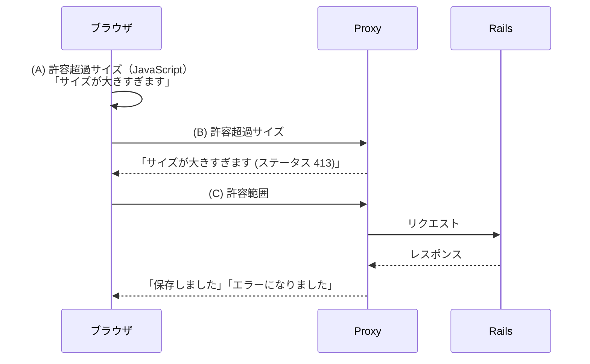

# Flashメッセージの統一的な表示方法（Rails/Turboによる試作）

通常の HTML レンダリングによる Flash の表示、Turbo Frame および Turbo Stream の場合の Flash の表示、そしてサーバサイドによらないクライアントサイドからの Flash の表示を統合したデモ・アプリケーションを作りました。その解説記事になります。

GitHub リポジトリ [unified-flash-messages](https://github.com/hiroaki/unified-flash-messages)

## モチベーション

ふたつの課題が同時にありました。

### クライアントサイドから Flashメッセージを出したい

最初の動機は、 Rails アプリの前段にある Proxy によってユーザからのリクエストが切断された時に、その旨のメッセージを Flash と同じようにユーザに見せたい、というものでした。

> 

具体的なストーリーはこうです。ユーザがフォームから許容できないほどの大きなファイルを送信した場合、クライアントサイドのチェック (A) を回避された時のためにサーバサイドでチェックするにしても、巨大すぎるものはそもそも Rails では受け取りたくないものですから、Proxy によってリクエストのサイズが制限値を超過したらそのリクエストは遮断するようにすることがひとつの対策になります (B)。

その際に「サイズが大きすぎます」というメッセージを、クライアントサイドのチェック時と、Proxy のレスポンスによる場合と出したいのですが、サーバサイドからの Flash の表示とは実装が分かれてしまうのをなんとかまとめたい、というわけです。つまりクライアントサイドのみでも、サーバサイドからの Flash と同一の UI表現でメッセージを表示できるようにしたいのです。

そしてもちろん、通常のサーバからのレスポンスでも、 Flash はそのまま利用できることが望ましいです。 (C)



*図：ケース (A) (B) (C) それぞれの「メッセージ」を、同一の UI で表示したい*


### Turbo Frame で Flash を表示したい

もうひとつの課題がありました。Turbo Frame を使ったページの部分的な更新の際に、同時に Flashメッセージも表示したいという点です。

私が作っていたアプリケーションでは、ページの部分的な更新のために Turbo Frame を使っていました。しかし Turbo Frame は指定のフレームの一箇所だけしか更新できませんから、 Flash の表示領域がそのフレーム外にある場合は手が出せません。

Turbo Stream を代用すれば複数の箇所を更新できますが、そのために GET リクエストを POST などに変えることは筋が違いますし、代替策はないだろうかと考えました。

```erb
<!-- フレーム外に置かれる Flash は Turbo Frame レスポンスからは更新できず... -->
<ul>
  <% flash.each do |type, message| %>
    <li data-type="<%= type %>"><%= message %></li>
  <% end %>
</ul>

<%= turbo_frame_tag "memos" do %>
  ...
  ...
```

## 実装の概要

これら課題は、次のようにすることで解決しました：
- サーバからの Flashメッセージは、非表示の DOM （以下 "ストレージ" ）に埋め込みます。
- クライアントからのメッセージも同じように、まずはストレージに埋め込みます。
- ページに変化が起きた際に、ストレージに埋め込まれたメッセージを取り出し、テンプレートで整形し、表示領域に挿入します。

いちばんのポイントはクライアントサイドで描画処理をするという点です。リクエストが Rails サーバに到達しない場合も処理するという制約があるために、メッセージを Flash の形に整えて、ページ上の所定の場所へ挿入する処理は、必然的にクライアントサイド、つまり JavaScript の役割となります。

むしろ、その制約のおかげでサーバサイドの処理も自然と決まります。テンプレートを Flash としてレンダリングするかわりに、データとしてページに埋め込むのです。

あとは対象のメッセージをどうやって埋め込むかを決め、それを適切なタイミングで描画するだけです。

今回作成したデモでは、以下のように取り決めました。


## Flashメッセージの埋め込み

### サーバーサイド

サーバサイドで生成する Flashメッセージは、非表示の要素に埋め込みます。クライアントサイドで描画処理を実行する時に、この構造を拾い集めることになります。

```html
<div data-flash-storage style="display: none;">
  <ul>
    <li data-type="alert">メッセージ1内容</li>
    <li data-type="notice">メッセージ2内容</li>
  </ul>
</div>
```

この構造は定型のものになるので、次の内容のヘルパーかパーシャル・テンプレートを用意しておくと良いでしょう：

```erb
<div data-flash-storage style="display: none;">
  <ul>
    <% flash.each do |type, message| %>
      <li data-type="<%= type %>"><%= message %></li>
    <% end %>
  </ul>
</div>
```

この要素は、その位置で描画・表示されるわけではないため、ドキュメント内のどの部分に置いても問題ありません。つまり Turbo Frame の中でもよく、言い換えれば Turbo Frame レスポンスを返すときには、この構造の非表示要素に Flashメッセージを書き出したものを含ませておくのです。

Turbo Stream もサポートする場合は、 Turbo Stream によって書き換える要素を指定する id が必要になるため、専用のストレージ領域をグローバルな位置に置いておきます：

```html
<div id="flash-storage" style="display: none;"></div>
```

そしてストリームの一つに "埋め込みの構造" を追加します：

```erb
<%= turbo_stream.update "flash-storage", partial: "shared/flash_storage" %>
```

> [!WARNING]
> たとえば Turbo Stream を経由してサーバがブロードキャストする設計では、送信先のストリームをサブスクライブしているクライアント（＝ブロードキャストの影響を受けるユーザ）全てにメッセージが配信されます。このため意図したユーザ以外にも同じ Flash が表示されてしまわないような実装にする必要があります。この記事で述べている「埋め込み→クライアント描画」は通常の同期的なレスポンスでは影響を受けませんが、ブロードキャスト型の配信を併用する際は配信の範囲に留意してください。

### クライアントサイド

クライアントサイドからも、同様の構造を書き出すようにします（再掲）：

```html
<div data-flash-storage style="display: none;">
  <ul>
    <li data-type="alert">メッセージ1内容</li>
    <li data-type="notice">メッセージ2内容</li>
  </ul>
</div>
```

これも定型の処理になるので、関数を用意しておきます：

```javascript
function appendMessageToStorage(message, type = 'alert') {
    const storage = document.createElement('div');
    ...
    ...
```

## 埋め込まれたメッセージを描画

### テンプレート

実際に表示される要素、つまり描画のテンプレートは `<template>` タグとして用意しておきます。 notice と alert と、 type ごとに作ります。 CSS クラス `flash-message-text` の要素の中にメッセージが挿入される予定です：

```html
<template id="flash-message-template-notice">
  <div>
    <span class="flash-message-text"></span>
  </div>
</template>
<template id="flash-message-template-alert">
  <div>
    <span class="flash-message-text"></span>
  </div>
</template>
```

そしてこのテンプレートから作られる Flash をどこに表示するかは、表示したい位置に、目印となる要素を置いておきます：

```html
<div data-flash-message-container></div>
```

### 描画処理

これらのルールを決めたので、それに則り、埋め込まれたメッセージ・データを整形して表示する JavaScript 関数を作ります。例えばこのようなものです：

```javascript
function renderFlashMessages() {
  const storages = document.querySelectorAll('[data-flash-storage]');
  const containers = document.querySelectorAll('[data-flash-message-container]');

  // 埋め込まれたメッセージを集めます
  let messages = [];
  storages.forEach(storage => {
    storage.querySelectorAll('ul li').forEach(li => {
      messages.push({ type: li.dataset.type || 'notice', message: li.textContent.trim() });
    });
    // 一度抽出したメッセージは、再利用されないように取り除きます
    storage.remove();
  });

  containers.forEach(container => {
    messages.forEach(({ type, message }) => {
      // createFlashMessageNode は、 <template> を複製して type と message を埋め込んだ要素を返します
      if (message) container.appendChild(createFlashMessageNode(type, message));
    });
  });
}
```

あとは任意のタイミングでこれを実行するだけです。

クライアントサイドからトリガーする場合は単に呼び出します。

サーバからのレスポンス時に表示したい場合は、ページに何かしらのイベントが発生しますので、それをあらかじめイベントリスナーとして登録しておき、そのハンドラーで描画関数を呼び出せば、レスポンス時に自動的に Flash が描画されるようになります。

- turbo:load
- turbo:frame-load
- turbo:render
- turbo:submit-end
- turbo:after-stream-render
- ...

通常は `turbo:frame-load` と `turbo:after-stream-render` を中心に監視し、必要に応じて `turbo:load` や `turbo:submit-end` を補助的に使います。

たとえばフォームを送信した際、Proxy エラー時やネットワーク障害などで Rails に到達しないケースでも、レスポンスを元にエラーメッセージを組み立てて、クライアントサイドのみでも Flash として表示することができます：

```javascript
document.addEventListener('turbo:submit-end', function(event) {
  const res = event.detail.fetchResponse;
  if (res === undefined) {
    appendMessageToStorage('ネットワークエラー', 'alert');
  } else {
    // レスポンスのステータスに応じた内容の埋め込みメッセージを作ります。
    // たとえば 413 ならば "サイズが大きすぎます"
    const message = ...
    appendMessageToStorage(message, 'alert');
  }

  renderFlashMessages();
});
```

一方でサーバーサイドの方ですが、 Flash をセットするコントーラでは、通常の Flashメッセージの表示の手続きとなんら変わるところがありません：

```ruby
def create
  @memo = Memo.new(memo_params)

  respond_to do |format|
    if @memo.save
      format.html { redirect_to @memo, notice: "Created successfully." }
      format.json { render :show, status: :created, location: @memo }
    else
      flash.now[:alert] = "Could not create."
      format.html { render :new, status: :unprocessable_content }
      format.json { render json: @memo.errors, status: :unprocessable_content }
    end
  end
end
```

変わるのはテンプレートです（再掲）：

```erb
<div data-flash-storage style="display: none;">
  <ul>
    <% flash.each do |type, message| %>
      <li data-type="<%= type %>"><%= message %></li>
    <% end %>
  </ul>
</div>
```

-----

以上のとおり、クライアントサイドからの任意のメッセージも、サーバサイドでの Flash 表示の場合と同じテンプレートを用いて表示をすることができました。

この実装の核心は、「メッセージを表示する前に一旦ページへ埋め込み、適切なタイミングで描画する」という二段階の仕組みにあります。Rails / Turbo に依存しないため、他のフレームワークや純粋な JavaScript でも実装できるでしょう。

コンセプトを実装してみた初期段階なので荒削りではありますが、様々な環境で試しているわけではないので、私に見えていない問題があるかもしれません。いまは概ねうまくいっているようですが、問題点や改善案などがありましたら、Issue やこの記事を通じてお知らせいただけますと幸いです。

GitHub リポジトリ [unified-flash-messages](https://github.com/hiroaki/unified-flash-messages)
