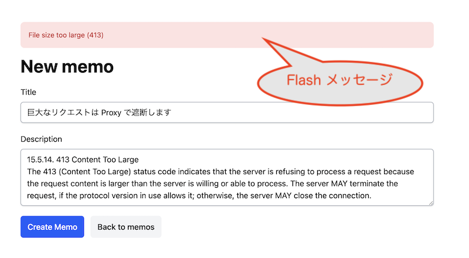
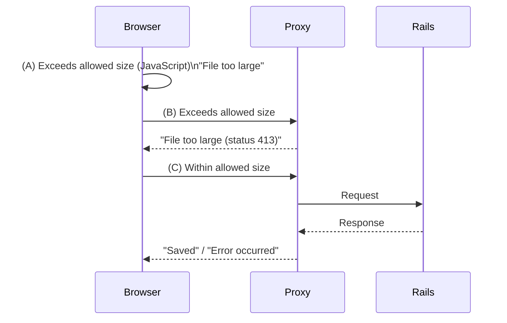

# Unified Flash Message Display Method (Prototype with Rails/Turbo)

This article explains a demo application that unifies the display of Flash messages for standard HTML rendering, Turbo Frame and Turbo Stream updates, and client-side (JavaScript) triggers independent of the server. 

GitHub repository: [unified-flash-messages](https://github.com/hiroaki/unified-flash-messages)

## Motivation

There were two simultaneous challenges.

### Displaying Flash Messages from the Client Side

The initial motivation was to show users a message—just like a Flash message—when a request from the user is cut off by a proxy in front of a Rails app.

> 

The concrete scenario is as follows: If a user submits a file that is too large via a form, even if you check on the client side (A), you need a server-side check in case the client check is bypassed. However, files that are too large should not even reach Rails, so a proxy is set up to reject requests exceeding a certain size (B).

In such cases, you want to show a "File too large" message both when the client-side check fails and when the proxy returns an error. However, the implementation for displaying Flash messages from the server and from the client would be separate, which is not ideal. The goal is to display messages with the same UI, even if they originate only on the client side.

Of course, it is also desirable that standard server-side Flash messages continue to work as usual (C).



*Figure: The goal is to display the "message" for each case (A), (B), and (C) with the same UI.*

### Displaying Flash Messages with Turbo Frame

Another challenge was displaying Flash messages when updating part of a page with Turbo Frame.

In my application, I used Turbo Frame for partial page updates. However, Turbo Frame can only update a single frame, so if the Flash message area is outside that frame, it cannot be updated.

Turbo Stream can update multiple areas, but changing a GET request to POST just for this is not ideal. I wondered if there was an alternative.

```erb
<!-- Flash outside the frame cannot be updated by Turbo Frame response... -->
<ul>
  <% flash.each do |type, message| %>
    <li data-type="<%= type %>"><%= message %></li>
  <% end %>
</ul>

<%= turbo_frame_tag "memos" do %>
  ...
  ...
```

## Implementation Overview

These challenges were solved as follows:
- Flash messages from the server are embedded in a hidden DOM element (hereafter "storage").
- Messages from the client are also first embedded in the same storage.
- When the page changes, messages embedded in storage are extracted, formatted with a template, and inserted into the display area.

The key point is that rendering is handled on the client side. Since there are cases where the request does not reach the Rails server, formatting the message as a Flash and inserting it into the designated area on the page must be handled by the client side, i.e., JavaScript.

In fact, this constraint also naturally determines the server-side processing. Instead of rendering a template as a Flash, the data is embedded in the page.

The only remaining tasks are to decide how to embed the target messages and to render them at the appropriate timing.

In the demo, the following conventions were adopted.


## Embedding Flash Messages

### Server Side

Flash messages generated on the server are embedded in a hidden element. The client-side rendering process will collect this structure.

```html
<div data-flash-storage style="display: none;">
  <ul>
    <li data-type="alert">Message 1 content</li>
    <li data-type="notice">Message 2 content</li>
  </ul>
</div>
```

This structure is standard, so it is best to prepare a helper or partial template as follows:

```erb
<div data-flash-storage style="display: none;">
  <ul>
    <% flash.each do |type, message| %>
      <li data-type="<%= type %>"><%= message %></li>
    <% end %>
  </ul>
</div>
```

This element is not displayed at its position, so it can be placed anywhere in the document. In other words, it can be inside a Turbo Frame. When returning a Turbo Frame response, include this hidden element with the Flash message.

If you also support Turbo Stream, you need a dedicated storage area with an id that can be updated by Turbo Stream, placed in a global location:

```html
<div id="flash-storage" style="display: none;"></div>
```

Then, add the "embedded structure" to one of the streams:

```erb
<%= turbo_stream.update "flash-storage", partial: "shared/flash_storage" %>
```

> [!WARNING]
> If the server broadcasts via Turbo Stream, all clients subscribed to the target stream (i.e., all users affected by the broadcast) will receive the message. Therefore, you must ensure that the same Flash is not displayed to unintended users. The "embed → client-side render" method described here is not affected by normal synchronous responses, but be mindful of the distribution range when using broadcast-type delivery.

### Client Side

The client side also writes out the same structure (as above):

```html
<div data-flash-storage style="display: none;">
  <ul>
    <li data-type="alert">Message 1 content</li>
    <li data-type="notice">Message 2 content</li>
  </ul>
</div>
```

This is also a standard process, so prepare a function:

```javascript
function appendMessageToStorage(message, type = 'alert') {
    const storage = document.createElement('div');
    ...
    ...
```

## Rendering Embedded Messages

### Template

The actual display elements, i.e., the rendering templates, are prepared as `<template>` tags, one for each type (notice, alert). The message will be inserted into the element with the CSS class `flash-message-text`:

```html
<template id="flash-message-template-notice">
  <div>
    <span class="flash-message-text"></span>
  </div>
</template>
<template id="flash-message-template-alert">
  <div>
    <span class="flash-message-text"></span>
  </div>
</template>
```

To specify where to display the Flash created from this template, place a marker element at the desired location:

```html
<div data-flash-message-container></div>
```

### Rendering Process

With these rules in place, create a JavaScript function to format and display the embedded message data. For example:

```javascript
function renderFlashMessages() {
  const storages = document.querySelectorAll('[data-flash-storage]');
  const containers = document.querySelectorAll('[data-flash-message-container]');

  // Collect embedded messages
  let messages = [];
  storages.forEach(storage => {
    storage.querySelectorAll('ul li').forEach(li => {
      messages.push({ type: li.dataset.type || 'notice', message: li.textContent.trim() });
    });
    // Remove extracted messages to prevent reuse
    storage.remove();
  });

  containers.forEach(container => {
    messages.forEach(({ type, message }) => {
      // createFlashMessageNode clones the <template> and fills in type and message
      if (message) container.appendChild(createFlashMessageNode(type, message));
    });
  });
}
```

Just call this function at any desired timing.

To trigger from the client side, simply call it.

To display after a server response, register an event listener for page events in advance, and call the render function in the handler to automatically render the Flash on response.

- turbo:load
- turbo:frame-load
- turbo:render
- turbo:submit-end
- turbo:after-stream-render
- ...

Usually, monitor `turbo:frame-load` and `turbo:after-stream-render`, and use `turbo:load` and `turbo:submit-end` as needed.

For example, when submitting a form, even if Rails is not reached due to a proxy error or network failure, you can construct an error message from the response and display it as a Flash on the client side:

```javascript
document.addEventListener('turbo:submit-end', function(event) {
  const res = event.detail.fetchResponse;
  if (res === undefined) {
    appendMessageToStorage('Network error', 'alert');
  } else {
    // Create an embedded message based on the response status.
    // For example, if 413, then "File too large"
    const message = ...
    appendMessageToStorage(message, 'alert');
  }

  renderFlashMessages();
});
```

On the server side, setting Flash in the controller is the same as usual:

```ruby
def create
  @memo = Memo.new(memo_params)

  respond_to do |format|
    if @memo.save
      format.html { redirect_to @memo, notice: "Created successfully." }
      format.json { render :show, status: :created, location: @memo }
    else
      flash.now[:alert] = "Could not create."
      format.html { render :new, status: :unprocessable_content }
      format.json { render json: @memo.errors, status: :unprocessable_content }
    end
  end
end
```

The only difference is the template (as above):

```erb
<div data-flash-storage style="display: none;">
  <ul>
    <% flash.each do |type, message| %>
      <li data-type="<%= type %>"><%= message %></li>
    <% end %>
  </ul>
</div>
```

-----

As shown above, arbitrary messages from the client side can be displayed using the same template as server-side Flash messages.

The core of this implementation is a two-step mechanism: "embed the message in the page before displaying it, and render it at the appropriate timing." Since it does not depend on Rails/Turbo, it can also be implemented in other frameworks or pure JavaScript.

This is an early-stage prototype of the concept, so it may be rough. Since it has not been tested in various environments, there may be issues I have not noticed. It seems to work well so far, but if you have any problems or suggestions for improvement, please let me know via an Issue or in this article.

GitHub repository: [unified-flash-messages](https://github.com/hiroaki/unified-flash-messages)
